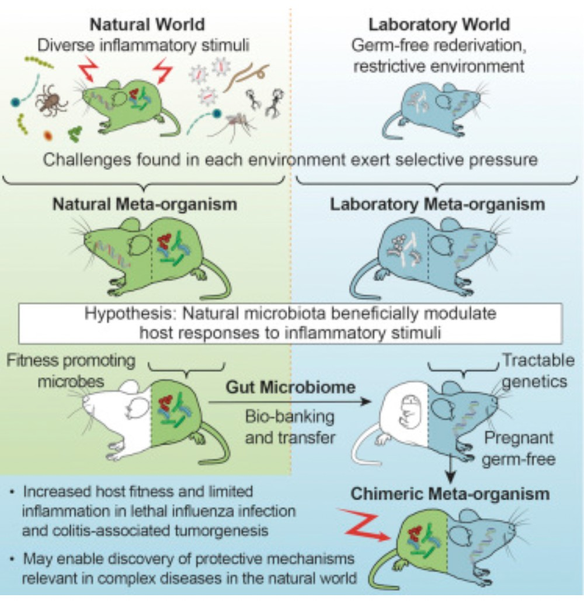
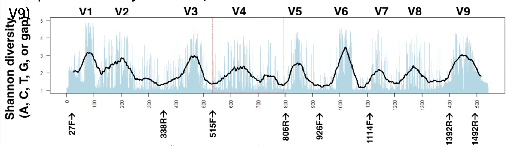
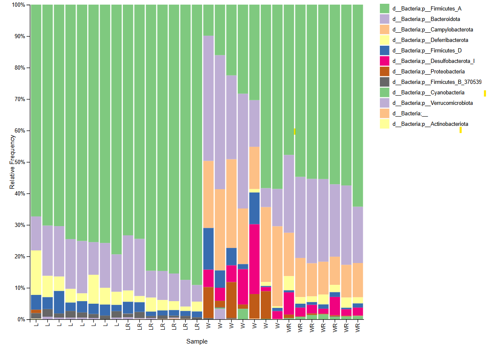
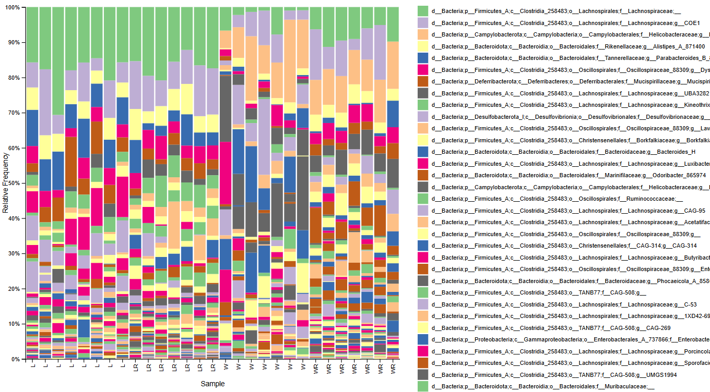
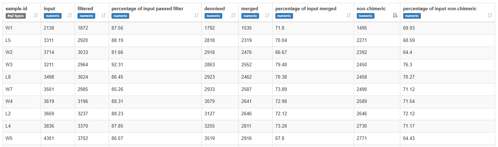
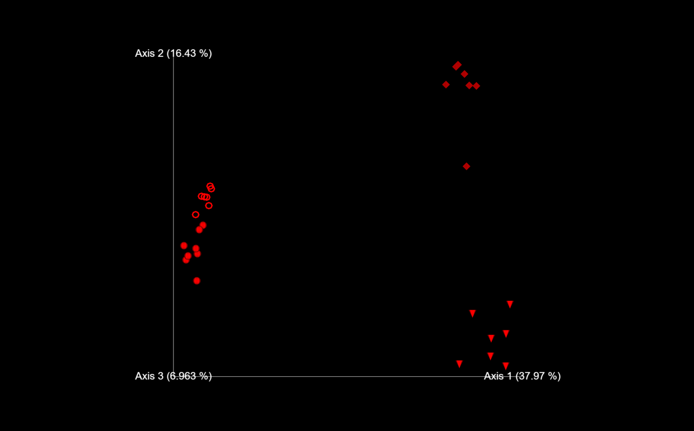
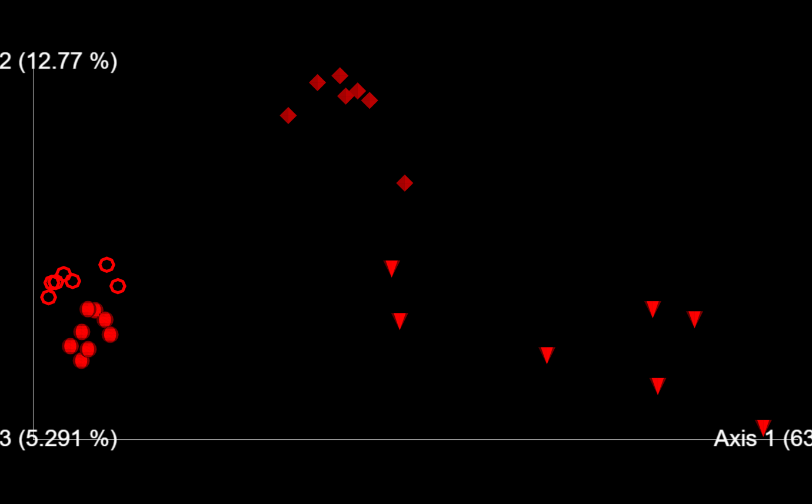

# Microbiome Mice Analysis

This repository contains the analysis pipeline and data from an experiment studying the gut microbiome of mice after fecal microbiota transplantation (FMT). The experiment investigates the transfer of microbiota from wild mice to germ-free (gnobiotic) mice and its potential impact on gut composition and overall health.

The data processing and analysis are carried out using standard bioinformatics tools like **QIIME2** for sequence analysis, **DADA2** for error correction, and taxonomic classification using a naive Bayes classifier.

## Table of Contents
- [Overview](#overview)
- [Experimental Design](#experimental-design)
- [Data Processing Pipeline](#data-processing-pipeline)
- [Results](#results)
- [Installation](#installation)
- [Usage](#usage)
- [Contributing](#contributing)
- [License](#license)

## Overview
In this study, wild mice and laboratory mice were compared to determine if wild mice have a more diverse and resistant microbiome. The goal was to test whether transferring microbiota from wild mice to germ-free mice would result in successful colonization and potential health benefits.

## Experimental Design
- **Control Group**: Germ-free mice (gnobiotic).
- **Experimental Group**: Wild mice with a diverse microbiome.
- **Procedure**: Fecal microbiota from wild mice was transferred to germ-free mice. The microbiome of the recipient mice was then analyzed using 16S rRNA sequencing (V4 region) to identify microbial composition.
- **Key Hypothesis**: The microbiome from wild mice may confer enhanced disease resistance and fitness to the recipient germ-free mice.

### Experiment Scheme


### Conservative and variable regions


## Data Processing Pipeline
1. **Data Acquisition**: Raw 16S rRNA sequencing data from fecal samples obtained from [data source](https://www.dropbox.com/s/bvr9djue7689mfb/mice_microbiome.zip?dl=1).
2. **Quality Control**: The raw data was imported into **QIIME2**, where it was trimmed, filtered, and corrected using **DADA2**.
3. **Taxonomic Classification**: The sequences were classified taxonomically using a naive Bayes classifier.
4. **Analysis**: Various downstream analyses were performed, including diversity estimation, comparison between groups, and the identification of significant microbial taxa.

### Tools and Methods
- **QIIME2**: Used for importing, processing, and analyzing microbiome data.
- **DADA2**: For quality control and error correction of sequencing data.
- **Naive Bayes Classifier**: For taxonomic classification of the sequences.

## Results
### Taxonomic Classification
The microbiome from both wild and laboratory mice successfully colonized the guts of germ-free mice, as evidenced by the similarity in microbiome composition between the donors and recipients. The dominant bacterial phylum in both environments is *Firmicutes_A*.

#### Figure 2
 

However, distinguishing a single dominant bacterial genus was challenging. Generally, laboratory mice predominantly harbor members of the *Lachnospiraceae* family, while wild mice are primarily colonized by the genus *Helicobacter_D*.

#### Figure 3
 

The bar plot shows a high level of alpha diversity across all groups.

### Diversity Analysis.
The smallest read count across samples was 1495, as shown in screenshot.

#### Figure 4
 

Downsampling to this value ensured fair comparisons across samples by normalizing sequencing depth. This normalization allowed for meaningful diversity metrics and statistical comparisons.

Shapes used in the diversity analysis plots:  
- **L** = Sphere  
- **LW** = Rings  
- **W** = Cone  
- **WR** = Diamond  

In the principal coordinates analysis (PCoA) plot in the figure below, Axis 1 explains 37.97% of the total variation, showing significant differences in microbial communities between groups. L and LR are clustered closely, indicating similar microbial compositions, while W and WR form distinct clusters, reflecting the microbial composition similarities between wild mice and their recipients.

#### Figure 5


The weighted UniFrac PCoA plot further highlights microbial community differences, with Axis 1 explaining 63.56% of the variation. The separation between laboratory (L, LR) and wild (W, WR) groups along Axis 1 confirms notable differences in their microbiome compositions. Additionally, Axis 2 differentiation between W and WR highlights beta diversity between wild donor mice and their recipients.

#### Figure 6


---

These findings support the hypothesis that the microbiota from wild mice successfully colonized germ-free mice, with distinct microbial profiles emerging post-transplantation.


## Installation

To run the analysis locally, follow these steps:

1. **Clone the repository**:
    ```bash
    git clone https://github.com/yourusername/Microbiome-Mice-Analysis.git
    cd Microbiome-Mice-Analysis
    ```

2. **Install QIIME2**:
    For QIIME2 installation instructions, follow the [official QIIME2 installation guide](https://docs.qiime2.org/).
    
3. **Install DADA2**:
    DADA2 can be installed as part of the QIIME2 environment, but follow the [DADA2 documentation](https://benjjneb.github.io/dada2/) if necessary.

4. **Install other dependencies**:
    If other dependencies are required (e.g., specific Python libraries or tools), list them here:
    ```bash
    pip install -r requirements.txt
    ```

## Usage

Once the repository is set up, follow the instructions below to run the analysis:

1. **Prepare raw sequencing data**: Ensure your raw data is in the appropriate format (e.g., FASTQ).
2. **Import the data into QIIME2**:
    ```bash
    qiime tools import --type 'SampleData[Sequences]' --input-path raw_data/ --output-path data.qza
    ```

3. **Run quality control and error correction**:
    ```bash
    qiime dada2 denoise-single --i-demultiplexed-seqs data.qza --p-trunc-len 150 --o-table table.qza --o-representative-sequences rep-seqs.qza --o-denoising-stats denoising-stats.qza
    ```

4. **Classify the sequences**:
    ```bash
    qiime feature-classifier classify-sklearn --i-classifier gg-13-8-99-515-806-nb-classifier.qza --i-reads rep-seqs.qza --o-classification taxonomy.qza
    ```

5. **Visualize and interpret the results**:
    Use the built-in QIIME2 visualization tools to inspect the results of your analysis.

## Contributing

We welcome contributions from the community. To contribute, please:
1. Fork the repository.
2. Create a new branch for your feature or bug fix.
3. Make your changes and submit a pull request with a clear description of your modifications.

## License

This project is licensed under the MIT License - see the [LICENSE](LICENSE) file for details.

---

**Note:** For additional documentation and detailed instructions on using the tools mentioned above, refer to the [QIIME2 Documentation](https://docs.qiime2.org/).
